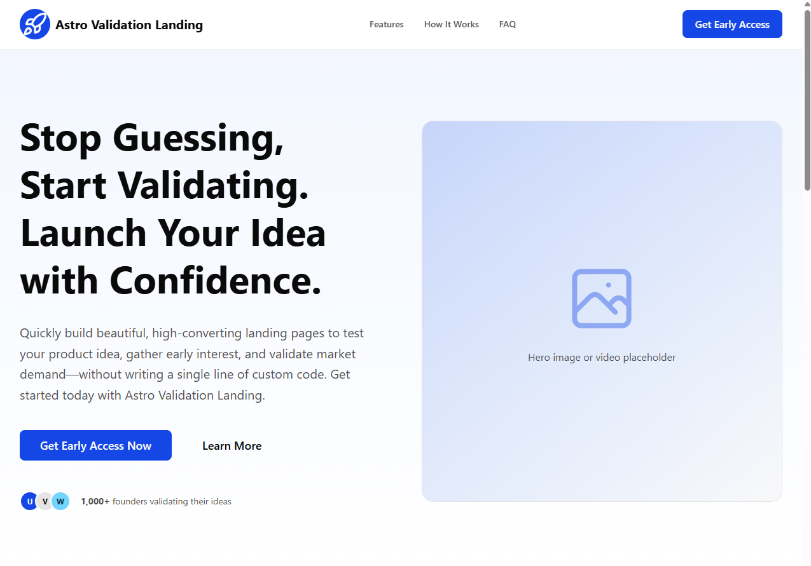

# Astro Validation Landing
[](https://astro.build/themes/details/astro-validation-landing/)

[](https://github.com/Sebasala/astro-validation-landing)

Astro Validation Landing is a conversion-focused landing page starter for validating product ideas quickly.
It combines Astro, Tailwind CSS v4, and Starwind UI primitives into a modular page that is easy to customize.



## Why

When launching a new product, validating your idea with real users before investing in development is crucial.
A well-designed landing page can help you collect emails, gauge interest, and get feedback on your concept.
This starter provides a solid foundation to create a compelling landing page without starting from scratch.

## What Is Included

- A complete one-page validation flow: Header, Hero, Problem/Solution, Features, How It Works, Testimonials, CTA, FAQ, Footer.
- Mobile-first responsive layout and dark mode support.
- SEO-ready layout tags (title, description, canonical, Open Graph, Twitter card).
- Centralized content configuration in a single file for fast copy updates.
- Tailwind CSS v4 design tokens with CSS variables for light and dark themes.

## Tech Stack

- [Astro 6](https://astro.build/)
- [Tailwind CSS v4](https://tailwindcss.com/)
- [Starwind UI](https://starwind.dev/) component primitives
- TypeScript (strict Astro config)

## Quick Start

[](https://astro-validation-landing.netlify.app/)
[](https://app.netlify.com/start/deploy?repository=https://github.com/Sebasala/astro-validation-landing)

### Prerequisites

- Node.js +22.12.0
- pnpm 10+

### Install And Run

```bash
pnpm install
pnpm dev
```

Open the local URL shown in your terminal (Astro defaults to `http://localhost:4321`).

### Build And Preview

```bash
pnpm build
pnpm preview
```

## Available Scripts

- `pnpm dev` - Start local dev server.
- `pnpm build` - Build production output to `dist/`.
- `pnpm preview` - Preview the production build locally.
- `pnpm astro ...` - Run Astro CLI commands directly.

## Project Structure

```text
.
|- public/
|  |- favicon.ico
|  |- launch.svg
|- src/
|  |- components/
|  |  |- Header.astro
|  |  |- Hero.astro
|  |  |- Description.astro
|  |  |- Features.astro
|  |  |- HowItWorks.astro
|  |  |- Testimonials.astro
|  |  |- CTA.astro
|  |  |- FAQ.astro
|  |  |- Footer.astro
|  |  |- starwind/
|  |- layouts/
|  |  |- Layout.astro
|  |- lib/
|  |  |- content.ts
|  |- pages/
|  |  |- index.astro
|  |- styles/
|  |  |- starwind.css
|- astro.config.mjs
|- starwind.config.json
```

## Customization Guide

### 1) Update Site Content

Most page copy and links live in `src/lib/content.ts`.

Update these exported objects to customize the landing page:

- `siteConfig`: SEO title/description and Open Graph image path.
- `header`: nav links and header CTA.
- `hero`: headline, subheadline, primary/secondary CTA labels and links.
- `problem` and `solution`: long-form narrative blocks.
- `features`: section heading and feature cards.
- `howItWorks`: three-step process content.
- `testimonials`: quote cards.
- `cta`: final conversion block copy and button label/link.
- `faq`: accordion questions and answers.
- `footer`: legal links, brand copy, and social URLs.

### 2) Update Theme And Design Tokens

Edit `src/styles/starwind.css` to customize:

- Light and dark color tokens (`:root` and `.dark`).
- Radius scale (`--radius`, `--radius-*`).
- Semantic variables used by components (`--primary`, `--muted`, etc.).

Tailwind v4 is configured through Vite in `astro.config.mjs`.

### 3) Replace Branding Assets

- Replace the placeholder logo SVG in `src/components/Logo.astro`.
- Replace favicon assets in `public/favicon.ico` and `public/launch.svg`.
- Add your Open Graph image and point `siteConfig.image` to it (for example `public/og-image.png`).

### 4) Built-in Lead Capture with Netlify Forms

Validating an idea requires collecting emails. We've made this incredibly easy using Netlify Forms. No external services, no API keys, and no backend code required.
How to use it:
In your CTA.astro component, add the data-netlify="true" attribute to your form element.

```Html
<form name="newsletter" method="POST" data-netlify="true">
  <input type="email" name="email" placeholder="Enter your email" required />
  <button type="submit">Get Early Access</button>
</form>
```

That's it. When you deploy to Netlify, they will automatically detect the form. You will see all your email signups directly in your Netlify Dashboard under the "Forms" tab.
Note: If you prefer to use an external service like Mailchimp or ConvertKit later, you can simply remove the data-netlify attribute and point the form action to your service provider's URL.

### 5) Wire The CTA To Your Email Tool

`src/components/CTA.astro` currently renders a form to capture leads directly in Netlify.
To collect data on other platforms or services you can connect the form to your own provider (Mailchimp, ConvertKit, Brevo, Formspree, custom endpoint, etc.) and handling submit.

## Section Anchor Map

The page includes these section IDs for in-page navigation:

- `#hero`
- `#features`
- `#how-it-works`
- `#cta`
- `#faq`
- `#testimonials`

Update header/footer links in `src/lib/content.ts` if you rename or reorder sections.

## Deployment Notes

This project builds to static assets and can be deployed to any static host (Netlify, Vercel static output, Cloudflare Pages, GitHub Pages, etc.).

Before deploying:

1. Set your production site URL in `astro.config.mjs` using Astro's `site` option.
2. Replace placeholder logos/icons and social links.
3. Wire up your email capture flow in the CTA section.
4. Ensure legal links in the footer point to real pages.
